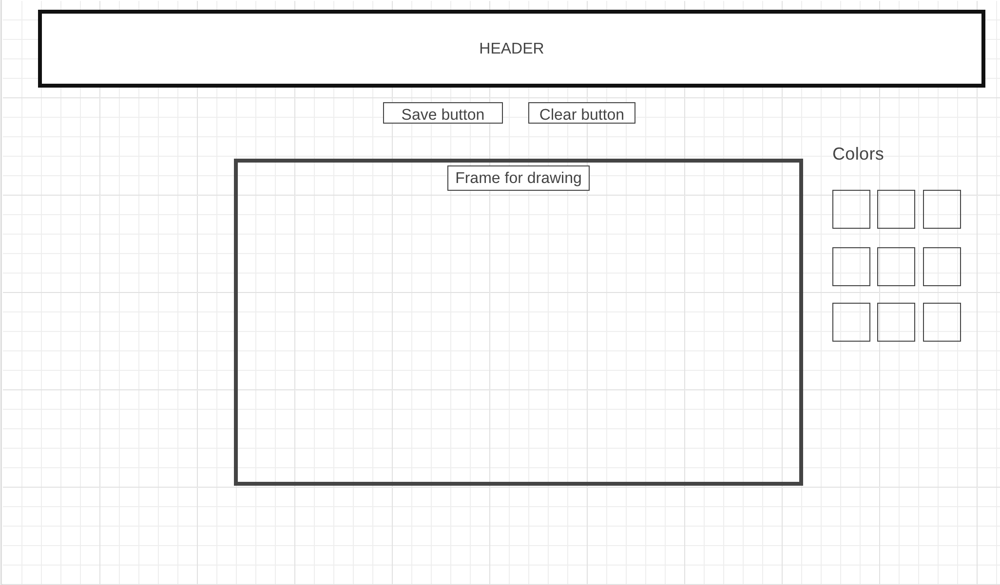
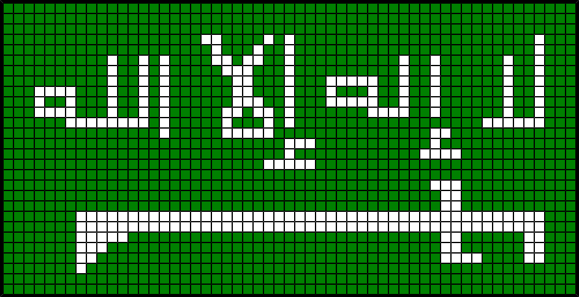
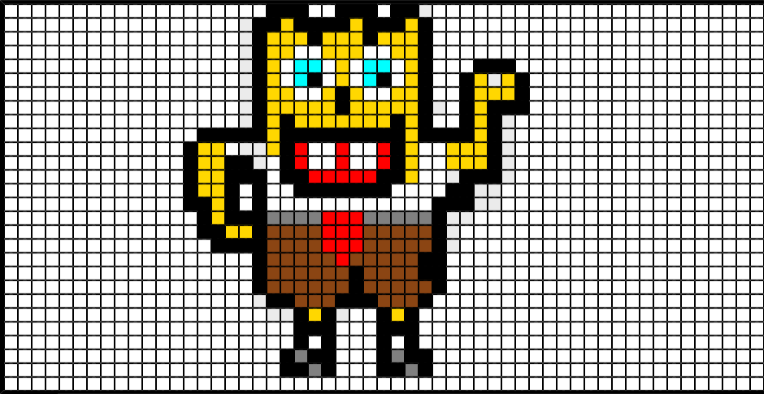

# Dixler

it is a simple drawing application using javascript . you draw with pxiels instead of vectors.

## Description

Every artist interested in pixel art can use it to make awsome drawings. game developers as well can use it to create their assets.

### Technical Used
I used these technologies to complete my project :
```
HTML
CSS
JavaScript, and jQuery for DOM manipulation

```

### Wireframes

this was the original sketch


### User Stories

A user should click on the color to choose it , then click on the frame to draw.
A user should keep pressing left click for continuous drawing.

---

## Planning and Development Process

After we took the class on manipulating the dom , i got the idea of developing this application , i was always facinated by pixel art , and i wanted to create something that will benifit all fans of pixel art.

### Problem-Solving Strategy

* I used console.log().
* grab the error and google it.


### Future Features

* adding a resizable frame on user choosing.
* adding different brush sizes.
* giving the user the ability to copy a shape.
* different kinds of shape (circle , square , etc..)

---

## Acknowledgments
* All the gratitude to the SEI instructors team for helping with all questions , espcially my squad leader "Yassir"
* filesave.js creator
* html2canvas creator
* jquery creator

---

## Examples for the app uses




---

 ## References

* FileSaver.js
https://cdnjs.cloudflare.com/ajax/libs/FileSaver.js/1.3.8/FileSaver.js

* Html2canvas
 https://github.com/niklasvh/html2canvas/releases/download/0.4.1/html2canvas.js

 * font: VT323
 https://fonts.googleapis.com/css?family=VT323

